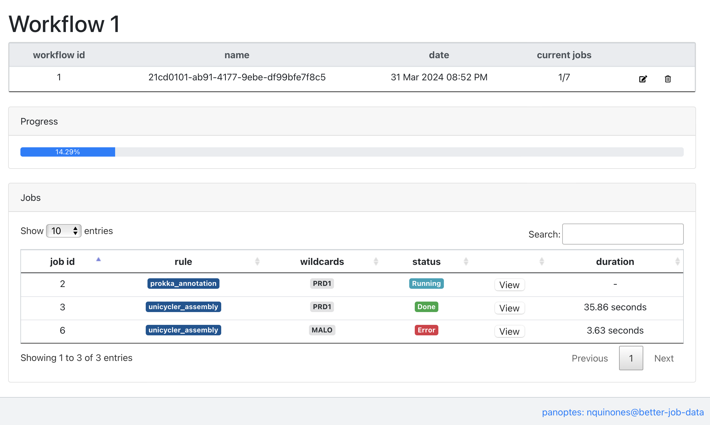
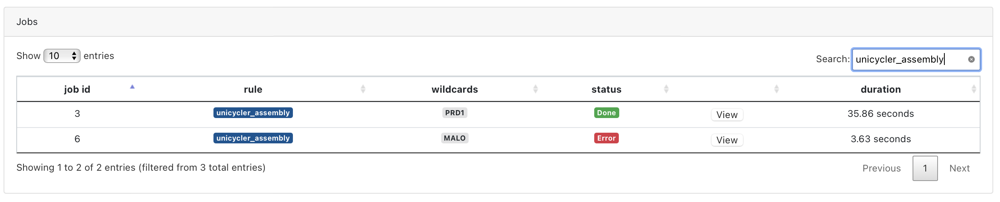
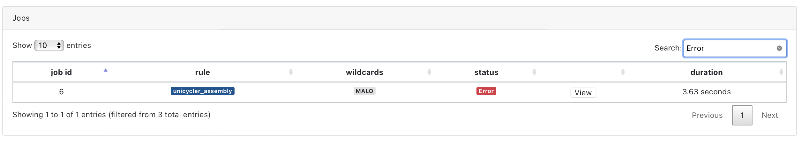
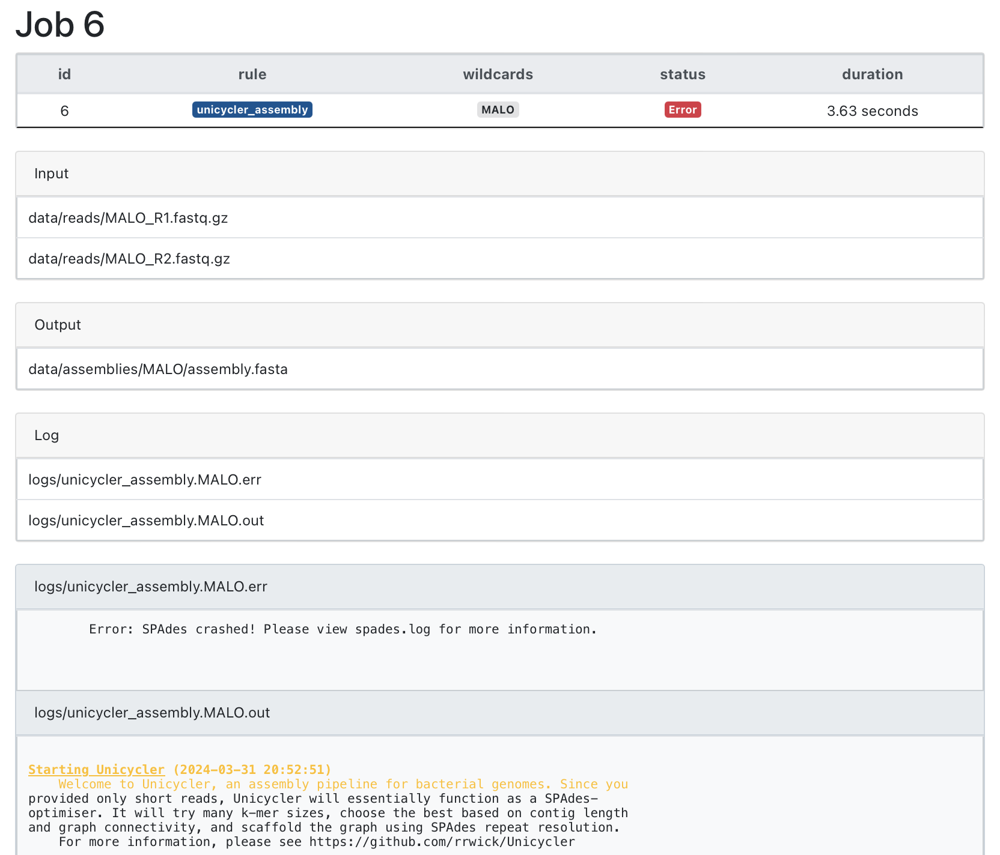

# 

Panoptes is a server that lets you monitor the execution of `snakemake` 
workflows. This is my personal panoptes branch, in which I have added a 
few features that I needed for my own workflows.

# Installation

## Install this branch

Create environment and activate it
```bash
# with conda
conda create -n panoptes python=3.8
conda activate panoptes
```
```bash
# or with virtualenv
virtualenv -p `which python3` venv
source venv/bin/activate
```

Install with pip
```bash
# directly from github
pip install git+https://github.com/nataquinones/panoptes.git@better-job-data
```

```bash
# or clone the branch and install it
git clone -b better-job-data https://github.com/nataquinones/panoptes.git
cd panoptes # or whatever the path where you downloaded the repo is
pip install .
```

# Usage
1. To use panoptes you first need to start the server. Once installed you can run:
```bash
panoptes
```
- The server should run on: `127.0.0.1:5000` by default. 

2. Then, you should run your `snakemake` pipeline with the option `--wms-monitor`
```bash
snakemake [options] --wms-monitor http://127.0.0.1:5000
# or whatever ip/port you are running panoptes. See options below.
```

3. Go to your browser and type: `http://127.0.0.1:5000` to see the panoptes dashboard.

## Options
```bash
$panoptes -h

usage: panoptes [-h] [--ip IP] [--port PORT] [--log path] [-v]

panoptes: monitor computational workflows in real-time

options:
  -h, --help     show this help message and exit
  --ip IP        Set the IP of the panoptes server [Default: 0.0.0.0]
  --port PORT    The port of the server [Default: 5000]
  --log path     Specify the path for the log files to be read. (default: cwd)
  -v, --verbose  Be Verbose
```

## How to use the `better-job-data` branch
I worked on this branch because I wanted to be able to debug my `snakemake`
pipelines, and for this, I wanted to see the logs of the jobs that failed. Two things
have to happen for it to work as intended:
1. The path for your log files should be specified in the `Snakefile`.
2. You have to tell `panoptes` where to find the log files.

### 1. Log files in the `Snakefile`
In particular, I wanted to see the `stout` and `stderr` for each of my rules. I usually
run my `Snakemake` pipelines in a cluster and specify the path for the `stout/stderr` in
the `--cluster/--cluster-config` options. (That is, before Snakemake 8 😒).
But for this part to work you need to specify the paths under `log:`, and make sure
they're  being written out to those files (with `>` and `2>`) to the path you specify. For example:


```python
rule assembly:
    input:
        # read files
        R1 = '{sample}_R1.fastq.gz',
        R2 = '{sample}_R2.fastq.gz'
    output:
        # assembly fasta file
        'assemblies/{sample}/assembly.fasta'
    params:
        outdir = 'assemblies/{sample}/'
    log:
        stderr = 'logs/unicycler_assembly.{sample}.err',
        stdout = 'logs/unicycler_assembly.{sample}.out'
    shell:
        'unicycler ' \
            '-1 {input.R1} ' \
            '-2 {input.R2} ' \
            '-o {params.outdir} '\
            '> {log.stdout} '\
            '2> {log.stderr}'
```
### 2. Tell panoptes where the log files are
You can specify the path to the log files in the `panoptes` server. This can be done
with the `--log` option. For example:
```bash
panoptes --log /path/to/logs
```
If you don't specify the path, `panoptes` will look for the log files in the 
current working directory. So, another option is to run panoptes from the same
directory where you're running your `snakemake` pipeline. For example:
```bash
cd /path/to/Snakefile
panoptes
```

### How do the changes look in the panoptes dashboard?
For each workflow, you can now see more detailed information about the jobs:


You can filter the table by the status of the jobs, by the rule 
name, wildcards, or any other property of the table:



In the job page, you can see the log files of the job:


## How to run on a Slurm cluster:
> TL;DR: Start a screen and an interactive job. Then -within- that initial screen you'll
> have to make two more screens: one for panoptes and another for snakemake.

1. SSH into to the cluster: 
```bash
ssh -Y -L <PORT>:127.0.0.1:<PORT> <user>@<host>
```
2. Start a screen:
```bash
screen -R <my_screen>
```
3. Within the screen, initiate an interactive job:
```bash
(<my_screen>)$ srun -t <time> --mem <mem> --pty -p <partition> --tunnel <PORT>:<PORT> bash
```

4. Make a new screen **within** <my_screen> and run panoptes.
```bash
(<my_screen>)$ screen -R <panoptes_screen>
(<my_screen>)(<panoptes_screen>)$ panoptes [options]--port <PORT>
```

5. Detach from the nested screen (Detach only from the nested screen! If you 
detach the usual way, you end up detaching from both)
```
Ctrl+a, followed by a, then d.
```

6. Make another screen **within** <my_screen> and run snakemake.
```bash
(<my_screen>)$ screen -R <smk_screen>
(<my_screen>)(<smk_screen>)$ snakemake [options] --wms-monitor http://127.0.0.1:<PORT>
```

# Get in touch
I hope you find this branch useful. If you have any questions or suggestions, please submit an
Issue. I am currently not pursuing a pull request into the main panoptes repository,
because it seems it is no longer in active development, but I might in the future if this
proves useful.

